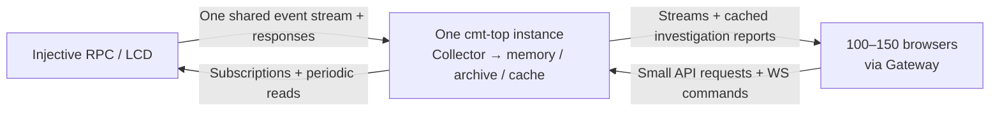

# Source load and bidirectional traffic

Measured and audited on 22 September 2026. These findings describe the capacity
implementation with one cmt-top instance. These measurements used isolated
fixtures and did not change the production deployment.

## Source load

Adding viewers creates no direct source RPC/LCD request or subscription. Each
process has one orchestrator and one upstream WebSocket with four subscriptions:
NewBlock, NewRound, Vote and ValidatorSetUpdates. Browser connections, resync,
investigation polling and full captures read shared local state and the archive.
Missing historical observations are not fetched from the source on demand.

Default polling per process: status every five seconds; validator RPC/LCD refresh
every 30 seconds; block-time refresh every 30 seconds (one extra status plus two
full blocks); upgrade LCD request every five minutes. Consensus HTTP fallback
adds a request per second while the stream is unavailable or stale. Pollers also
run at startup. Validator-update events can request an earlier refresh.

With one RPC validator page and one LCD staking page, healthy polling is about
20 RPC requests/minute plus 2.2 LCD requests/minute. RPC pages contain up to 100
validators, LCD pages up to 200 including inactive validators. Optional monitored
RPC comparisons add up to a status and a full-block request every five seconds
on the primary and each monitored endpoint. Plain failover endpoints are tried
on failure. A second cmt-top replica duplicates collection. Application overload
can indirectly cause delayed ingestion, retries or fallback; there is no
per-viewer source request path.

Implementation references: `cmd/cmt-top/main.go`, `internal/core/orchestrator.go`,
`internal/core/comparison.go`, `internal/config/config.go`,
`internal/web/server.go`, `internal/web/rounds_cache.go` and `internal/web/ws.go`.

## Direct measurement of both directions

A separate loopback experiment inserted counting reverse proxies between source
and application, and application and protocol clients. It replayed 45 validators,
one round per block, one-second block spacing and empty transaction blocks. Both
runs observed 1,843 additional source events, four additional status requests,
one upstream WebSocket and the same four subscriptions.

| Direction | One viewer | 150 viewers |
| --- | ---: | ---: |
| Source → cmt-top | 0.234 Mbps | 0.238 Mbps |
| cmt-top → source | 0.283 kbps | 0.286 kbps |
| Viewers → cmt-top | 1.72 kbps | 124 kbps |
| cmt-top → viewers | 0.366 Mbps | 106.62 Mbps |

Source bytes were essentially identical: 691,752 versus 691,749. The small rate
difference comes from the measured wall time. These are illustrative synthetic
rates, not Injective bandwidth estimates. Counts include HTTP headers and WS
framing, but exclude TCP/IP, acknowledgements, TLS and retransmissions. The short
window excludes collector warmup and did not cross longer-period polling ticks.
The one-viewer case is an investigator; the 150-viewer case is half investigators
and half dashboard viewers, so their downstream ratio is not a per-user scaling
estimate. The protocol clients also send fewer browser headers and no SPA assets.
See [raw directional measurements](../testdata/capacity/results/directional-replay.json).

## Browser-side network planning

The following estimates linearly scale per-viewer received payload from the
recorded replay. They are workload averages, not guaranteed peaks. Mixed uses
the five-minute, 200-session run; heavy investigation uses the 150-investigator,
128-round run. Measurement durations include the initial three-second ramp.

| Workload | 100 viewers | 150 viewers | Approximate download per viewer |
| --- | ---: | ---: | ---: |
| Mixed dashboard / investigation | 87 Mbps (10.8 MB/s) | 130 Mbps (16.3 MB/s) | 0.87 Mbps |
| All investigating 128 retained rounds | 198 Mbps (24.8 MB/s) | 297 Mbps (37.2 MB/s) | 1.98 Mbps |

At the 150-viewer rates, continuous traffic would be roughly 59 GB/hour for the
mixed workload or 134 GB/hour for the heavy workload. Neither is a daily usage
forecast. Tests deliberately produce persistent divergence/late evidence.
Response headers, framing, TLS, TCP acknowledgements, assets, and interactive
capture bursts need additional capacity. Source traffic does not multiply by
these downstream rates.

A reasonable test target is a 1 Gbps full-duplex application-to-Gateway path,
with about 600 Mbps available egress headroom for the heavy 150-viewer workload.
That is a planning allowance, not a measured required minimum or a claim about
current infrastructure. Per viewer, 5–10 Mbps available download gives headroom
above measured averages; complete evidence exports can require several MB at
once. Reverse application requests are much smaller, but TCP acknowledgements
add reverse traffic beyond the measured 124 kbps.

The actual Injective source-link requirement remains unmeasured. NewBlock events
include transaction-containing blocks and can include application execution
results; HTTP block reads fetch complete blocks as well. Approximate incoming
bandwidth is event frequency × serialized event size plus polled response bytes.
For example, two 1 MB NewBlock messages per second alone require 16 Mbps; that is
an illustration, not an observed Injective rate. Measure the real collector link
passively before assigning a source-side bandwidth budget.

## Delivery speed

Votes and other incremental events are forwarded as received. Ordinary full
dashboard/context repair snapshots run once per second. Active investigations
poll about once per second, with up to 250 ms cache coalescing; settled pages poll
about every five seconds. Hidden or paused investigations suspend automatic reads.
Local report p99 was about 18 ms in the strict mixed smoke and 105 ms in the
resource-limited heavy run; these are HTTP response timings, not measured
chain-event-to-screen latency. WAN latency and Gateway behavior still require
staging measurements.

See [recorded capacity results](../testdata/capacity/results/README.md) and
[testing / operational limits](CAPACITY_TESTING.md).
