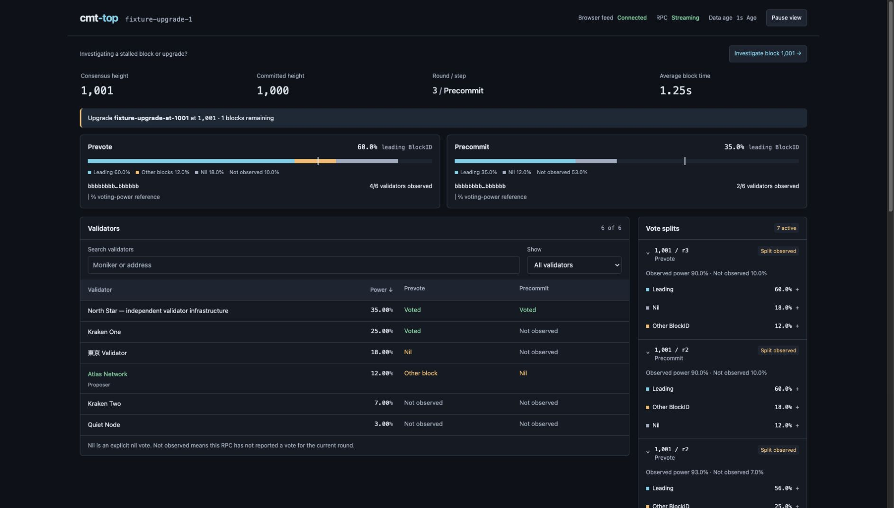
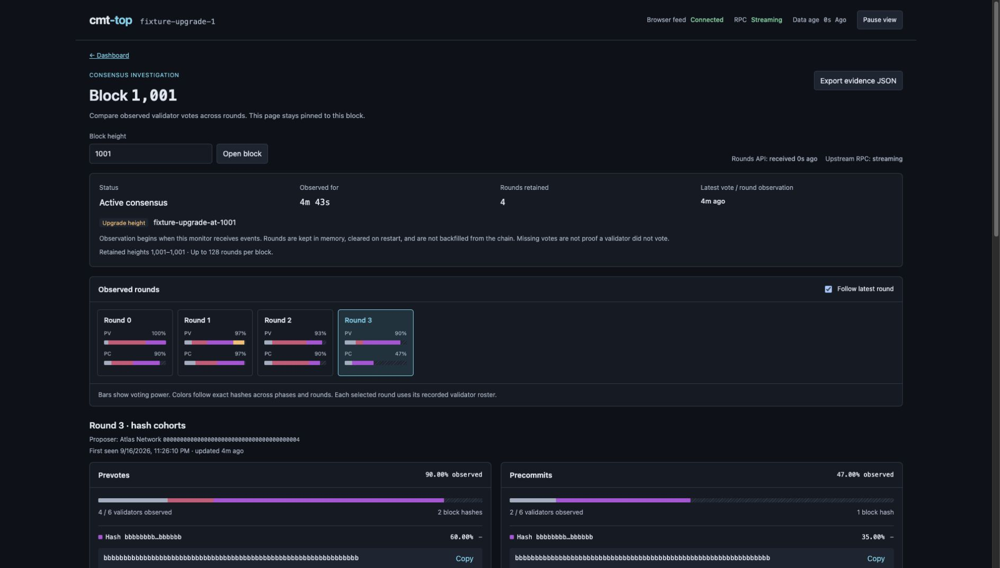
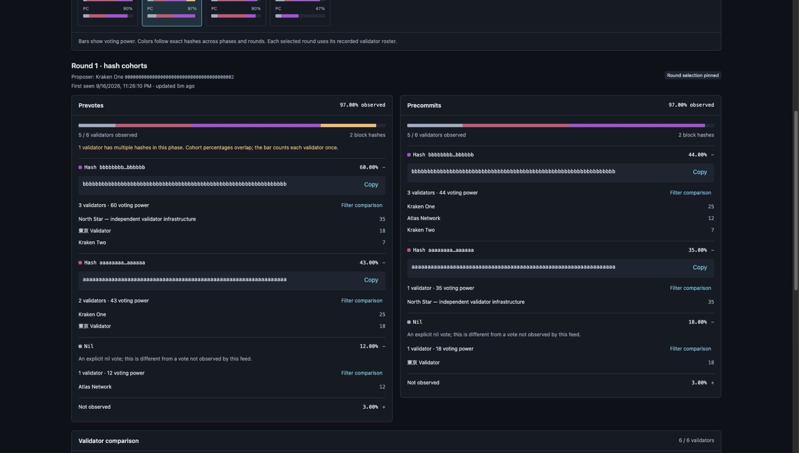
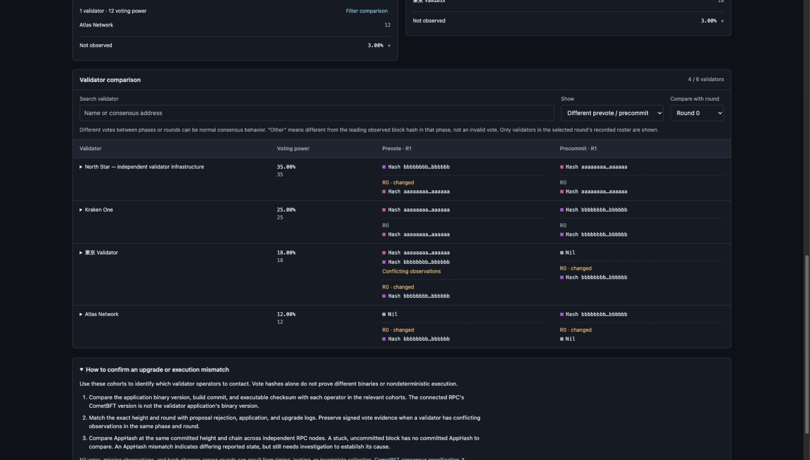
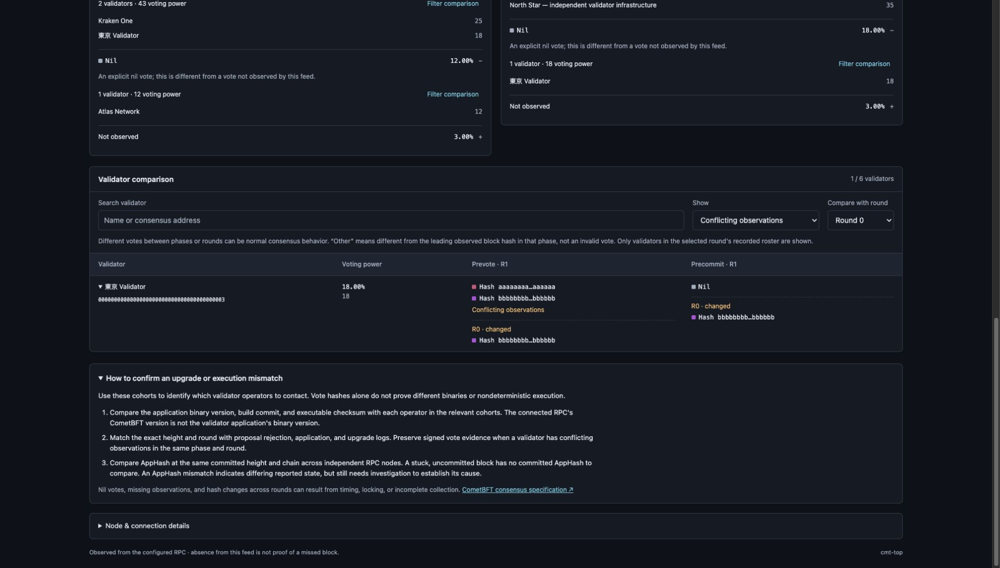

# Investigate block: screenshot walkthrough

Use **Investigate block** when consensus is stuck at an upgrade height. Keep one block open, follow its rounds, compare prevote and precommit hash groups, and identify validator operators whose builds and logs need a closer look.

This walkthrough uses real screenshots of the **synthetic demo**, on chain `fixture-upgrade-1` at block **1,001**. Names, addresses, and hashes are test data, not evidence about real validators. The demo has six validators and four fixed rounds (0–3); it does not contact a blockchain or keep generating new rounds. Times and observation ages will differ on your machine.

## Run the demo

From the repository root, with Go, Node.js, and pnpm installed:

```sh
make web
go run -tags webui ./internal/web/testdata/dashboard -scenario upgrade -listen 127.0.0.1:18082
```

Keep that process running. Open the [demo dashboard](http://127.0.0.1:18082/) or go directly to the [block 1,001 investigation](http://127.0.0.1:18082/blocks/1001/rounds). If the demo is already running on that port, use the existing instance.

For your own chain, run the normal web app against your RPC and start monitoring **before** the upgrade. See the [configuration guide](../USAGE.md#configuration).

## 1. Open the block from the dashboard

Click **Investigate block 1,001 →** above the consensus summary. The demo shows consensus at height 1,001 while the latest committed height is 1,000.



The investigation URL is `/blocks/1001/rounds`. You can bookmark it or replace the height with the block you want to inspect.

## 2. Check coverage and choose a round

The page stays pinned to **Block 1,001**, even if the chain later advances. To change height, enter it in **Block height** and click **Open block**.



Check these indicators before interpreting the votes:

| Indicator | What to read |
|---|---|
| Rounds API / Upstream RPC | Whether this page is receiving responses and the upstream feed is streaming. |
| Latest vote / round observation | How recently a consensus observation arrived. A healthy connection does not guarantee new votes. |
| Rounds retained / retained heights | Which observations are still available; coverage warnings flag missing rounds or incomplete data. |
| PV / PC on each round card | The percentage of voting power **observed** for prevotes / precommits, not the percentage agreeing on one hash. |

**Follow latest round** initially selects Round 3. It has 90% prevote power observed and 47% precommit power observed. Click **Round 1** to inspect an earlier round. This turns off following and shows **Round selection pinned**. Turn following back on to track the newest round for this same block.

## 3. Compare prevote and precommit hash groups

With **Round 1** selected, scroll to **Round 1 · hash cohorts**. The panels group validators by the full hash observed in each phase. Expand a group to see its members; **Copy** copies the full hash.



For this example, **A** means the 64-character all-`a` hash and **B** means the all-`b` hash.

| Round 1 observation | Prevotes | Precommits |
|---|---:|---:|
| Hash B group | 60% | 44% |
| Hash A group | 43% | 35% |
| Explicit nil vote | 12% | 18% |
| Not observed | 3% | 3% |
| Unique observed voting power | 97% | 97% |

The prevote groups overlap: **東京 Validator**, with 18% voting power, has observations for both A and B. Consequently, 60% + 43% + 12% exceeds 100%. The warning explains this, and the bar counts each validator once. Do not add overlapping group percentages as independent voting power.

**Nil** is an explicit received nil vote. **Not observed** means this feed has not reported that vote; it does not establish that the validator was offline.

Use **Filter comparison** inside a group to jump to matching validators below. A hash filter matches that hash in either phase. Use **Clear hash filter** before trying an unrelated example; search, hash, and **Show** filters combine.

## 4. Compare individual validators with a reference round

Scroll to **Validator comparison**, then set:

1. **Compare with round → Round 0**.
2. **Show → Different prevote / precommit**.



You should see **4 / 6 validators**: North Star, Kraken One, 東京 Validator, and Atlas Network. Each cell shows the selected round's observation first, then the reference under **R0**. A **changed** label marks a difference from that reference.

For example, North Star's prevote changes from A in Round 0 to B in Round 1, while its precommit remains A. Kraken One has different hashes between its Round 1 phases, but its observations are unchanged from Round 0. These are two distinct comparisons.

Other useful **Show** options:

| Filter | Use it to find |
|---|---|
| Changed from reference round | Differences across rounds; this demo returns five validators for Round 1 versus Round 0. |
| Other than leading block hash | Observations differing from the leading observed hash in a phase; “other” does not mean invalid. |
| Any nil vote / Any vote not observed | Explicit nil votes or gaps in this feed. |
| Conflicting observations | Multiple hashes for one validator within the same phase and round. |

Use **Search validator** for a name or consensus address. Expand a validator's name to reveal its full address.

## 5. Inspect a conflicting observation

Keep Round 1 selected and Round 0 as the reference. Change **Show → Conflicting observations**, then expand **東京 Validator**.



Only **1 / 6 validators** remains. The selected round contains both A and B prevote observations for this validator, followed by a nil precommit. Its Round 0 reference shows B in both phases.

This is a reason to inspect the underlying evidence. The monitor does not verify signatures or produce a cryptographic double-sign proof. Likewise, vote groups alone cannot tell you which binary a validator runs or prove nondeterministic execution.

Use the full consensus addresses to identify the operators to contact. Compare their application versions, build commits, executable checksums, upgrade configuration, and logs for this exact height and round. The **How to confirm an upgrade or execution mismatch** panel provides the same next steps.

## 6. Pause and export the evidence

Return to the top of the page:

1. Use **Pause view** to freeze the displayed observations while reading or taking screenshots. The server continues collecting. **Resume** refreshes the page's evidence.
2. Click **Export evidence JSON** to download `cmt-top-block-1001-rounds.json` for this example.

The export includes the full retained investigation, its context, and the selected/reference round. It is **not limited to the filtered table rows**. When paused, it exports the last fetched evidence; resume first if you want a fresh export. There is currently no import/replay control in this page.

History lives in server memory and is cleared on restart. The default retention is 32 heights, configured by `divergence.history_size`, with at most 128 observed rounds per height. Export before restarting or allowing the evidence to leave retention. Earlier rounds cannot be reconstructed from before monitoring began.

For coverage limits, conflicting-vote interpretation, same-height AppHash comparisons, and the API, see the [block investigation reference](../BLOCK_INVESTIGATION.md).
